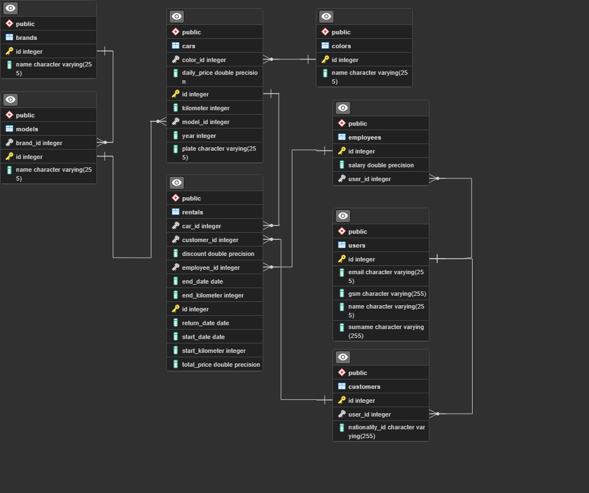

# 
<h3> 🚥 Rent A Car Project 🚥</h3> 

Rent a Car projesi, kullanıcıların kolayca araç kiralayabileceği bir   çevrimiçi platformu sağlamayı amaçlayan bir web uygulamasıdır.   Bu platform, kullanıcıların ihtiyaçlarına uygun araçları seçmelerini,   rezervasyon yapmalarını ve kiralama işlemlerini kolayca tamamlamalarını   sağlayarak kullanıcı dostu bir deneyim sunmayı hedeflemektedir.

---

## ` 🛠️ Language and Tools` 

  
<a href="https://www.postgresql.org/" target="_blank"> 
<a href="https://projectlombok.org/" target="_blank">  
<a href="https://hibernate.org/" target="_blank">  
<a href="https://swagger.io/" target="_blank">  
<a href="https://spring.io/projects/spring-data-jpa" target="_blank"> 

---

## ` 📊 ER Diagram with PostgreSQL`

---

## `Project Team`

- [Abdulkadir Aydemir](https://github.com/AbdulkadirAydemir)
- [Esra Akbulut](https://github.com/esrasrtkara)
- [Mehmet Fatih Ünal](https://github.com/mfu97)

---

## ` 🙏 Acknowledgements`

- [Tobeto](https://tobeto.com/)
- [Halit Enes Kalaycı](https://github.com/halitkalayci)